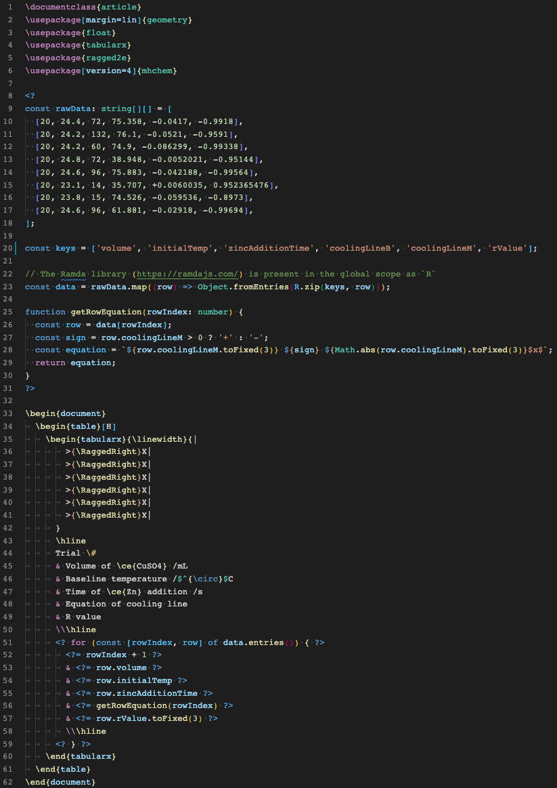
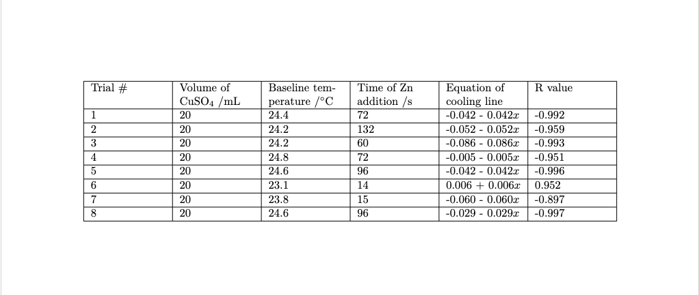
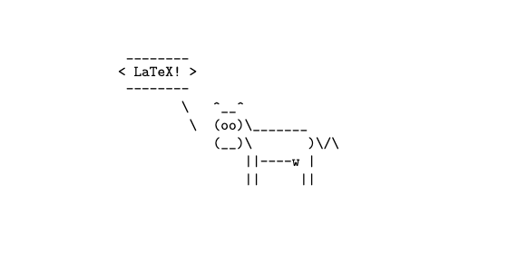

# JSLaTeX

[](https://marketplace.visualstudio.com/items?itemName=leonzalion.jslatex)

Supercharging LaTeX with JavaScript through [EJS](https://ejs.co)/[ETS (embedded TypeScript!)](https://github.com/leonzalion/ets)

**Note:** Instead of `<%` and `%>` tags, JSLaTeX uses `<?` and `?>` in order maintain compatibility with existing LaTeX tools such as LaTeX formatters (since `%` are treated as comments in LaTeX).

## Installation

To install the JSLaTeX compiler, run:

```shell
npm install --global jslatex
```

## Usage

To compile a LaTeX file with EJS/ETS, run:

```shell
jslatex <file>
```

For example, if your LaTeX file was named `chem.tex`, you would run:

```shell
jslatex chem.tex
```

This would produce a file in the same directory called `chem.out.tex`. Because the outputted LaTeX document is pure LaTeX, it can be passed to standard LaTeX tools, like `latexmk` or `lualatex`.

If you want to specify the name of the output file, you can use the `-o` or `--out` option:

```shell
jslatex chem.tex -o compiled-chem.tex
```

## Example

The following [chem.tex](packages/compiler/test/fixtures/chem.tex) file (syntax highlighting provided by the [JSLaTeX VSCode extension](https://marketplace.visualstudio.com/items?itemName=leonzalion.jslatex)):



Gets compiled by JSLaTeX into the following LaTeX code:

```latex
\documentclass{article}
\usepackage[margin=1in]{geometry}
\usepackage{float}
\usepackage{tabularx}
\usepackage{ragged2e}
\usepackage[version=4]{mhchem}


\begin{document}
  \begin{table}[H]
    \begin{tabularx}{\linewidth}{|
        >{\RaggedRight}X|
        >{\RaggedRight}X|
        >{\RaggedRight}X|
        >{\RaggedRight}X|
        >{\RaggedRight}X|
        >{\RaggedRight}X|
      }
      \hline
      Trial \#
      & Volume of \ce{CuSO4} /mL
      & Baseline temperature /$^{\circ}$C
      & Time of \ce{Zn} addition /s
      & Equation of cooling line
      & R value
      \\\hline

        1
        & 20
        & 24.4
        & 72
        & -0.042 - 0.042$x$
        & -0.992
        \\\hline

        2
        & 20
        & 24.2
        & 132
        & -0.052 - 0.052$x$
        & -0.959
        \\\hline

        3
        & 20
        & 24.2
        & 60
        & -0.086 - 0.086$x$
        & -0.993
        \\\hline

        4
        & 20
        & 24.8
        & 72
        & -0.005 - 0.005$x$
        & -0.951
        \\\hline

        5
        & 20
        & 24.6
        & 96
        & -0.042 - 0.042$x$
        & -0.996
        \\\hline

        6
        & 20
        & 23.1
        & 14
        & 0.006 + 0.006$x$
        & 0.952
        \\\hline

        7
        & 20
        & 23.8
        & 15
        & -0.060 - 0.060$x$
        & -0.897
        \\\hline

        8
        & 20
        & 24.6
        & 96
        & -0.029 - 0.029$x$
        & -0.997
        \\\hline

    \end{tabularx}
  \end{table}
\end{document}
```

Note that there is no trace of the original JavaScript code in the final LaTeX file.

This LaTeX can then be compiled by a standard LaTeX compiler like `pdflatex` or `lualatex` to produce the following PDF file:



You can also use imports within EJS:

```latex
\documentclass{article}

<? const { default: cowsay } = await import('cowsay') ?>

\begin{document}
\begin{verbatim}
<?# Using the cowsay package from https://www.npmjs.com/package/cowsay ?>
<?= cowsay.say({ text: 'LaTeX!' }) ?>
\end{verbatim}
\end{document}
```

The above JSLaTeX code gets compiled to:

```latex
\documentclass{article}


\begin{document}
\begin{verbatim}

 ________
< LaTeX! >
 --------
        \   ^__^
         \  (oo)\_______
            (__)\       )\/\
                ||----w |
                ||     ||
\end{verbatim}
\end{document}
```

And when compiled with a standard LaTeX compiler, the corresponding output PDF will display the following:



## Programmatic Usage

You can import JSLaTeX as a regular `npm` package and call it from Node.js:

```javascript
import { compileJsLatex, compileJsLatexFile } from 'jslatex';

const result = await compileJsLatex(String.raw`
\documentclass{article}
<?= "Hello from EJS!" ?>
`);

console.log(result);
// Outputs:
/*
\documentclass{article}
Hello from EJS!
*/

console.log(await compileJsLatexFile('cow.tex'));
```
